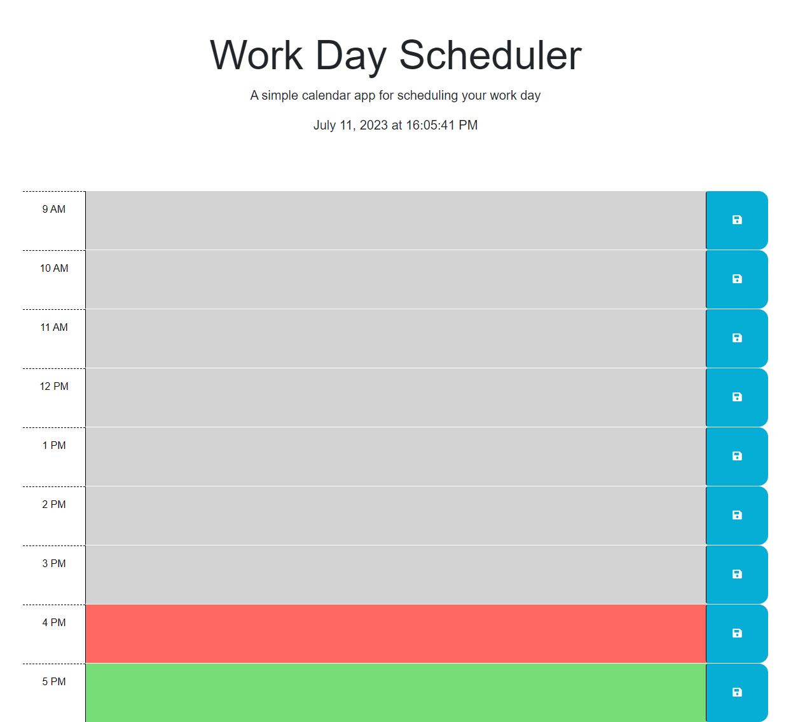

# Daily Work Planner

## Description

A simple daily planner for your work day. You can add text to the time blocks for reminders, meetings, to-dos, etc. and click the save button to the right side to save your content to come back to later. The time blocks will automatically update in color based on the time of day to indicate blocks in the past, present, and future. 

## Installation

N/A

## Usage

The daily planner can be viewed and used [here](https://savannah-shifflet.github.io/daily-planner/). Below is a screenshot of the page.

 

## Credits

The University of Texas at Austin coding bootcamp. 

## License

Please refer to the LICENSE in the repo.
